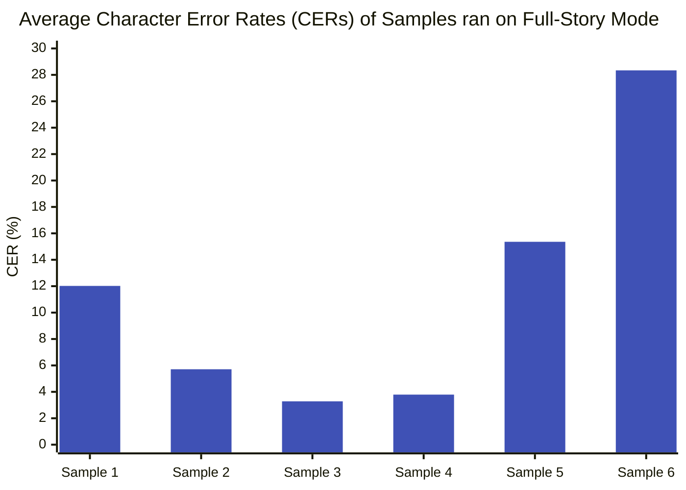
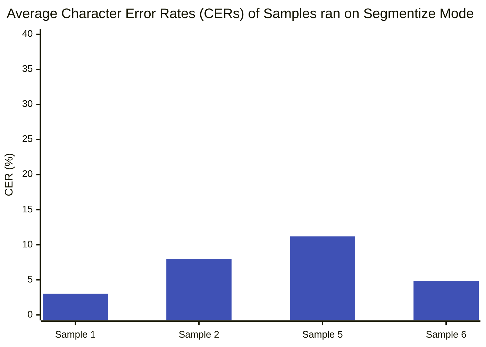

# Rolling Ticker Extraction from Broadcast Video

_- [Sanjib Das](https://www.linkedin.com/in/sanjib-das-6226342a9/)_

### Project Guidance

- **Mentors:** Parth Dhola Sir and Amaan Irfan Sir
- **Faculty Advisor:** Prof. Prithwijit Guha 

*Developed during an internship at EICT IIT Guwahati.*

**[Go to Setup and Installation Guide](Setup_Guide.md)**
**[Go to the Project GitHub Repository](https://github.com/Sanjib-22/Rolling-Ticker-Text-Extraction)**
**[Get the PDF version of this Report](Rolling_Ticker_Extraction_Report.pdf)**

## 1. Introduction

Extracting scrolling news-ticker text from broadcast video presents its own set of challenges distinct from subtitle or speech transcription. Ticker text is small, often low-contrast against a moving or brightly colored background band, scrolls continuously rather than appearing as discrete captions, and frequently overlaps with channel branding, secondary tickers, or on-screen graphics.

This project builds a ticker-extraction pipeline for broadcast news video, using manual ticker-region selection, a sliding-window OCR approach, and story-boundary stitching to reconstruct individual news items from the continuously scrolling text. Two extraction strategies are evaluated - a full-length read from a fixed start timestamp to the end of the clip, and a segment mode that first splits the video on scene changes before reading each segment independently - and both are scored against ground-truth scripts using Character Error Rate (CER) and Word Error Rate (WER).

This report documents the extraction methodology, the mathematical operations underlying each pipeline stage, the evaluation approach for each mode, the full results across six broadcast clips spanning two channels and three clip lengths, and a direct comparison of the two modes' accuracy.

---

## 2. Project Demonstration

<div align="center">
  <iframe width="800" height="450" src="https://www.youtube.com/embed/83neoKqOx9A?si=lFKMFrv3cYMPVO84" title="YouTube video player" frameborder="0" allow="accelerometer; autoplay; clipboard-write; encrypted-media; gyroscope; picture-in-picture; web-share" referrerpolicy="strict-origin-when-cross-origin" allowfullscreen></iframe>
</div>

---

## 3. Video Samples for Evaluation

To evaluate extraction accuracy realistically, six broadcast news clips were selected across two channels and three durations:

| Name | Type | Duration | Link |
| :--- | :--- | :--- | :--- |
| **Sample 1** | Short | ~1 mins | [YouTube](https://youtu.be/33FxRDpCdTA) |
| **Sample 2** | Short | ~2 mins | [YouTube](https://youtu.be/33FxRDpCdTA) |
| **Sample 3** | Short | ~1 mins | [YouTube](https://youtu.be/AiC9v0oa5Y8) |
| **Sample 4** | Short | ~2 mins | [YouTube](https://youtu.be/AiC9v0oa5Y8) |
| **Sample 5** | Long | ~10 mins | [YouTube](https://youtu.be/VFqmPqb_01g) |
| **Sample 6** | Long | ~10 mins | [YouTube](https://www.youtube.com/live/vc3INCu9wJQ?si=RlTqEws2qn6G-cG9) |

Channels and durations were chosen deliberately: DD India and CNN News18 use visually different ticker styles (positioning, font, scroll speed, background contrast), and the three durations test whether extraction accuracy holds up as read length increases - a single continuous full-length read accumulates more opportunity for drift than a short clip.

---

## 4. Pipeline Architecture

The pipeline reads a manually specified ticker region (left, top, width, height, as percentages of frame size) rather than attempting automatic ticker-region detection. This was a deliberate simplification: broadcast ticker position and styling vary enough across channels that manual selection, verified with a live region preview before running extraction, proved more reliable than a general-purpose detector for the channels evaluated here.

The system architecture is organized as follows:


---

### 4.1 Ticker Region Conversion

The normalized region - picked once per channel as percentages of frame width/height - is converted to pixel coordinates for a frame of width $W$ and height $H$ before every crop:

$$ x_p = xW, \qquad y_p = yH, \qquad w_p = wW, \qquad h_p = hH $$

### 4.2 Sliding-Window OCR & Frame Preprocessing

Within the selected region, the pipeline uses a sliding-window OCR approach: overlapping frame samples are read via Tesseract OCR, and a story-stitching step reconstructs individual news items from the continuously scrolling text by merging overlapping OCR reads and identifying story boundaries.

Before a crop reaches Tesseract, it is optionally gamma-corrected to boost contrast between the ticker text and its background band:

$$ I_{\text{out}} = I_{\text{in}}^{1/\gamma} $$

```python
# pipeline/tesseract.py - applied before every OCR read
if requests('gamma_correct', self._preprocesses):
    image = gamma_to_intensity(image, **self._preprocesses)

image = hist_adjust(image, **self._preprocesses)
```

Two modes are available for reading the ticker once the region and preprocessing are fixed:

- **Full length mode** -> given a single start timestamp, the ticker is read continuously to the end of the clip, producing a list of stories each with a `start_time/end_time`.
- **Segment mode** -> the video is first split on scene changes, and each resulting segment is read independently, producing per-segment extracted text plus optional per-story evaluation within that segment.

### 4.3 Scene-Change Detection (Segment Mode)

Segment mode compares consecutive sampled frames' colour histograms - each normalized by total pixel count - to decide where one scene ends and the next begins:

$$ H(i) = \frac{n_i}{\sum_j n_j} $$

The implementation supports four histogram-comparison methods; **Bhattacharyya distance** is the one used for the documented segment-mode results, with the others available as alternatives:

$$ BC(H_1, H_2) = \sum_i \sqrt{H_1(i)\,H_2(i)} $$

$$ D_B(H_1, H_2) = -\ln\big(\max(BC(H_1, H_2),\ 10^{-10})\big) $$

```python
# pipeline/video_segmentor.py
def calc_bhattacharyya_distance(self, hist1, hist2):
    bc = self.calc_bhattacharyya(hist1, hist2)
    bc = max(bc, 1e-10)
    return -np.log(bc)
```

*Alternative histogram-comparison methods implemented in the same segmentor, not used for the reported results:*

$$ D_{\chi^2}(H_1, H_2) = \frac{1}{2}\sum_i \frac{\big(H_1(i)-H_2(i)\big)^2}{H_1(i)+H_2(i)+\varepsilon} $$

$$ \rho = \frac{\sum_i \big(H_1(i)-\bar H_1\big)\big(H_2(i)-\bar H_2\big)}{\sqrt{\sum_i \big(H_1(i)-\bar H_1\big)^2 \sum_i \big(H_2(i)-\bar H_2\big)^2}} $$

### 4.4 Ticker Speed & Story Reconstruction

To reconstruct a single continuous "long text" out of many overlapping sliding-window reads, the pipeline estimates how fast the ticker scrolls in pixels/frame by matching the same word across consecutive sampled frames:

$$ v = \frac{x_t - x_{t+\Delta t}}{\Delta f} $$

```python
# pipeline/slidingreader.py - matched word pairs within configured bounds
pixel_diff = word1['left'] - word2['left']
estimate = pixel_diff / frame_diff
```

Every detected word is then mapped onto a shared long-text coordinate using its own frame number $f$ and the estimated speed $v$, which is what lets overlapping reads from different frames be merged and clustered into single words before story boundaries are found:

$$ x_{\text{long}} = x + v f $$

---

## 5. Evaluation Methodology

Extraction accuracy is measured with Character Error Rate (CER) and Word Error Rate (WER), computed against an optional ground-truth script uploaded per video. Where no script is supplied, extraction still runs but no evaluation metrics are produced.

- Full-length mode evaluates each extracted story against its corresponding reference story directly.
- Segment mode required a different approach. Text extraction was performed only on segments longer than 3 seconds - shorter segments yielded unreliable results due to the limited number of frames, which led to inaccurate speed estimation and poor image stitching. For per-segment story evaluation, a precision-based approach was used instead of a recall-based one.

A recall-based comparison would have measured extracted text against reference stories containing characters not present within that segment's boundaries, artificially inflating CER/WER. Since segments generated via scene-change detection often contain incomplete ticker stories by construction, precision-based evaluation - scoring only what was actually extracted, against the portion of the reference it corresponds to - is the more appropriate metric.

### 5.1 String-Matching Primitives

Story-to-reference matching and fragment alignment are both built on a standard edit-distance dynamic-programming recurrence:

$$ D(i,j) = \min\big\{\,D(i-1,j)+1,\ D(i,j-1)+1,\ D(i-1,j-1)+[x_i \neq y_j]\,\big\} $$

From this distance, the pipeline's string-metric utility derives an error rate, its complementary accuracy, and a length-normalized similarity score used when aligning candidate matches:

$$ ER = \frac{D(s_1, s_2)}{|s_2|} \qquad\qquad A = 1 - ER \qquad\qquad S = 1 - \frac{D(s_1, s_2)}{\max(|s_1|, |s_2|)} $$

### 5.2 Reported Accuracy Metrics: CER & WER

The headline numbers in the results below are Character Error Rate and Word Error Rate — substitutions, deletions, and insertions normalized by the length of the reference:

$$ CER = \frac{S_c + D_c + I_c}{N_c} \qquad\qquad\qquad WER = \frac{S_w + D_w + I_w}{N_w} $$

```python
# pipeline/evaluator.py — evaluate_story()
cer_score = round(cer(ref_clean, ext_clean), 4)
wer_score = round(wer(ref_clean, ext_clean), 4)
```

---

## 6. Results

### 6.1 Full-Length Mode

| Sample | Channel | Duration | Filtered CER | Filtered WER |
|--------|------------|----------|---------------|---------------|
| Sample 1 | DD India | 1 min | 0.1202 | 0.1949 |
| Sample 2 | DD India | 2 mins | 0.0571 | 0.2187 |
| Sample 3 | CNN News18 | 1 min | 0.0328 | 0.0976 |
| Sample 4 | CNN News18 | 2 mins | 0.0379 | 0.0900 |
| Sample 5 | DD India | 10 mins | 0.1536 | 0.3234 |
| Sample 6 | CNN News18 | 10 mins | 0.2834 | 0.3705 |
| **Average (overall)** | | | **0.1142** | **0.2159** |
| **Average — DD India** | | | **0.1103** | **0.2457** |
| **Average — CNN News18** | | | **0.1180** | **0.1860** |

**Analysis:** at 1–2 minute lengths, CNN News18 clips extract noticeably more accurately than DD India (CER ~0.035 vs. ~0.089 average). That gap narrows sharply at 10 minutes - CNN's Sample 6 (CER 0.2834) is the single worst result across all six clips, pulling CNN's channel average up to roughly match DD India's. Error rate appears to scale with clip duration for both channels, most likely from ticker drift, OCR degradation over longer sliding-window reads, or accumulated story-boundary misalignment across a long continuous read.

### 6.2 Segment Mode

*Note: Sample 3 and 4 produced no scene changes, so no segments were generated - they were evaluated using the entire 1-minute and 2-minute videos respectively instead (see the Full-Length Mode table for their figures).*

**Sample 1** — DD India, 1 min

| SEG | START | END | DUR | JUMP | STORIES | FRAG CER | FRAG WER |
|-----|----------|----------|------|------|---------|----------|----------|
| 1 | 00:00:00 | 00:00:09 | 9.33 | 3 | 1 | 0.0000 | 0.0000 |
| 2 | 00:00:09 | 00:00:26 | 16.8 | 6 | 3 | 0.0611 | 0.1111 |
| 3 | 00:00:28 | 00:00:38 | 12.13 | 4 | 2 | 0.0593 | 0.1429 |
| 4 | 00:00:40 | 00:00:50 | 10.27 | 3 | 2 | 0.0000 | 0.0000 |
| **Average** | | | | | | **0.0301** | **0.0635** |

**Sample 2** — DD India, 2 mins

| SEG | START | END | DUR | JUMP | STORIES | FRAG CER | FRAG WER |
|-----|----------|----------|-------|------|---------|----------|----------|
| 1 | 00:00:00 | 00:00:04 | 4.67 | 1 | 1 | 0.2031 | 0.3000 |
| 2 | 00:00:04 | 00:01:04 | 59.73 | 22 | 8 | 0.0829 | 0.1739 |
| 3 | 00:01:04 | 00:01:22 | 17.73 | 6 | 3 | 0.0278 | 0.1111 |
| 4 | 00:01:24 | 00:01:38 | 14.0 | 5 | 3 | 0.0443 | 0.1217 |
| 5 | 00:01:38 | 00:01:49 | 11.2 | 4 | 3 | 0.0413 | 0.2963 |
| **Average** | | | | | | **0.0799** | **0.2006** |

**Sample 5** — DD India, 10 mins

*Contains 32 segments in total; only the first 9 are shown below for brevity. The average row reflects the full segment set.*

| SEG | START | END | DUR | JUMP | STORIES | FRAG CER | FRAG WER |
|-----|----------|----------|-------|------|---------|----------|----------|
| 1 | 00:00:00 | 00:00:05 | 5.6 | 2 | 1 | 0.0000 | 0.0000 |
| 2 | 00:00:06 | 00:00:23 | 16.8 | 6 | 2 | 0.0761 | 0.1825 |
| 3 | 00:00:23 | 00:00:36 | 13.07 | 4 | 3 | 0.1053 | 0.2083 |
| 4 | 00:00:36 | 00:00:50 | 14.0 | 5 | 2 | 0.0846 | 0.1666 |
| 5 | 00:00:52 | 00:01:14 | 22.4 | 8 | 4 | 0.1077 | 0.3167 |
| 6 | 00:01:14 | 00:01:34 | 19.6 | 7 | 4 | 0.0350 | 0.0357 |
| 7 | 00:01:34 | 00:02:45 | 70.93 | 26 | 9 | 0.2145 | 0.3588 |
| 8 | 00:02:45 | 00:02:56 | 11.2 | 4 | 1 | 0.0256 | 0.0833 |
| 9 | 00:02:57 | 00:03:06 | 14.93 | 3 | 3 | 0.0417 | 0.0833 |
| **Average (all 32 segments)** | | | | | | **0.1119** | **0.2393** |

**Sample 6** — CNN News18, 10 mins

| SEG | START | END | DUR | JUMP | STORIES | FRAG CER | FRAG WER |
|-----|----------|----------|--------|------|---------|----------|----------|
| 1 | 00:00:00 | 00:07:54 | 474.13 | 177 | 39 | 0.1751 | 0.3300 |
| 2 | 00:07:54 | 00:08:08 | 14.0 | 5 | 2 | 0.0053 | 0.0357 |
| 3 | 00:08:08 | 00:08:22 | 14.0 | 5 | 1 | 0.0123 | 0.0909 |
| 4 | 00:08:23 | 00:09:46 | 83.07 | 31 | 6 | 0.0508 | 0.2273 |
| 5 | 00:09:47 | 00:09:55 | 8.4 | 3 | 1 | 0.0000 | 0.0000 |
| **Average** | | | | | | **0.0487** | **0.1368** |

**Analysis:** Across the four shorter samples (1 and 2 minute clips), fragment CER stays low (0.01–0.10), consistent with the precision-based scoring approach - each segment's extracted text is judged only against the reference text it actually corresponds to. Sample 2 is a partial outlier, with segment 1 (a short 4.67s fragment) showing a comparatively high 0.2031 CER despite the sample's overall average staying moderate. The two 10-minute samples show the highest segment-mode averages overall (Sample 5: 0.1119, Sample 6: 0.0487, per the full-length vs. segment comparison below) - within Sample 5's rows shown here, segment 7 (a 70.93s fragment) stands out at 0.2145 CER, while Sample 6's error is led by segment 1, its longest fragment at 474.13s, with a CER of 0.1751.

### 6.3 Full-Length vs. Segment Mode - Comparison

The table below aggregates both modes' CER and WER across all six evaluation videos, mirroring how the extraction strategies are compared directly.

| Sample | Channel | Duration | Full-Length CER | Segment Avg CER | Full-Length WER | Segment Avg WER |
|--------|------------|----------|------------------|------------------|------------------|------------------|
| Sample 1 | DD India | 1 min | 0.1202 | 0.0301 | 0.1949 | 0.0635 |
| Sample 2 | DD India | 2 mins | 0.0571 | 0.0799 | 0.2187 | 0.2006 |
| Sample 3 | CNN News18 | 1 min | 0.0328 | n/a | 0.0976 | n/a |
| Sample 4 | CNN News18 | 2 mins | 0.0379 | n/a | 0.0900 | n/a |
| Sample 5 | DD India | 10 mins | 0.1536 | 0.1119 | 0.3234 | 0.2393 |
| Sample 6 | CNN News18 | 10 mins | 0.2834 | 0.0487 | 0.3705 | 0.1368 |
| **Average** | | | **0.1142** | **0.0451** | **0.2159** | **0.1067** |

*Average across the five samples where segment mode produced results (excludes Sample 3 & 4). "n/a" indicates no segments were generated.*

The two charts below plot the CERs of both full-length mode and segmentize mode using a total of six samples and four samples respectively.





**Segment mode's lower error:** Segment mode shows a lower average CER/WER than full-length mode on three of the four comparable samples - most visibly on Sample 6, where segment mode's CER (0.0487) is less than a fifth of full-length mode's (0.2834). This is consistent with segment mode's precision-based evaluation: shorter, scene-bounded fragments give the OCR/story-assembly pipeline less room to drift or misalign story boundaries than one long continuous read does.

**Sample 2 is the exception:** Segment mode's average CER is higher than full-length mode's, though not dramatically (0.0799 vs. 0.0571). Its segments were also comparatively few (5 segments across 2 minutes, durations from 4.67s to 59.73s), with segment 1's short 4.67s fragment landing close to the pipeline's own 3-second minimum-duration filter - which may partly explain the reduced reliability there relative to the other samples.

**Caveat:** The two modes are not scored on an identical basis. Segment mode uses fragment-aligned, precision-style scoring (`evaluate_segments`), while full-length mode scores each story against its best-matching full reference line and reports the boundary-filtered average (`evaluate_all`). The deltas above should therefore be read as directionally informative rather than strictly like-for-like.

---

## 7. Deployment

Unlike a decoupled backend/frontend architecture, this project ships as a single Streamlit application - extraction, evaluation, and the results UI (including video playback synced to the extracted transcript) all run within one process. A single user runs one extraction at a time, so there's no need for shared state, a job queue, or a separate API layer - a full client-server split would only add deployment overhead here without changing what the tool does.

**Running the app**
```bash
streamlit run app.py
```

Full setup, dependency, and CLI instructions are in the **[Setup and Installation Guide](Setup_Guide.md)**.

---

## 8. Conclusion

Across six broadcast clips, segment mode's precision-based evaluation shows a lower average error rate than full-length mode, most clearly on the two 10-minute clips where full-length mode's error builds up over the long continuous read. The two modes also fail differently: full-length mode's error rises steadily with clip length, while segment mode's error is usually low but occasionally spikes on a single bad segment (as with Sample 6's fragment 1, or Sample 2's short, closely-packed segments).

Full-length mode stays simpler and doesn't depend on scene-change detection finding good cut points - Sample 4's lack of scene changes shows that dependency directly. In practice, segment mode looks like the better choice for shorter clips with clear scene changes, while full-length mode is more dependable for longer or visually static clips. A hybrid approach - segment mode where cuts are dense enough, full-length otherwise - would be a natural next step rather than picking one mode per video upfront.